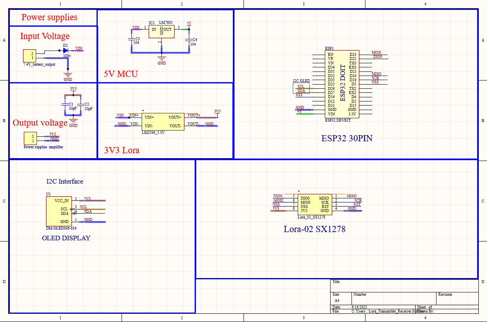
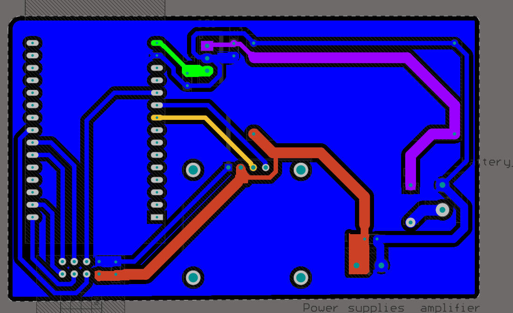
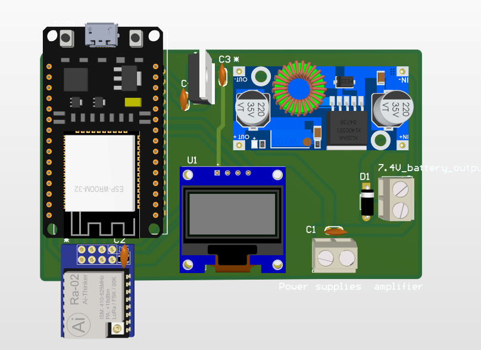
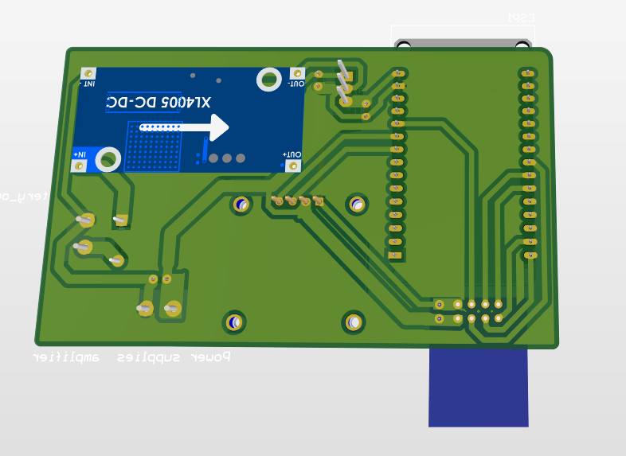

# LoRa Communication System with ESP32

A long-range wireless communication system using LoRa technology and two ESP32 boards.  
The firmware supports **two transmission modes**—automatic and manual—and lets you switch between them with the on-board **BOOT** button or automatically when the USB Serial Monitor is detected.

---

## 📋 Project Overview
| Feature | Description |
|---------|-------------|
| **Auto mode** | Sends predefined messages every *n* seconds, each packet prefixed with a running counter (`1:Hello`, `2:Test…`) so the receiver can check order and losses. |
| **Manual mode** | Type any text in the Serial Monitor and press *Enter* to transmit instantly. |
| **Mode switching** | • Press **BOOT (GPIO 0)** to toggle modes.• If Auto mode is running and USB serial data is detected, the firmware switches to Manual automatically. |
| **OLED UI** | 128 × 64 SSD1306 screen shows current mode, last message, packet counter, and quick help. |
| **Long-range LoRa settings** | SF 12, BW 62.5 kHz, CR 4/5, 20 dBm TX power (≈ 8–19 km LoS). |

---

## 🛠️ Bill of Materials
| Qty | Item                                  |
|-----|---------------------------------------|
| 2   | ESP32 DevKit (any WROOM / WROVER)     |
| 2   | LoRa module SX1276 / SX1278 (433 MHz) |
| 2   | 433 MHz antenna (3–5 dBi recommended) |
| 2   | SSD1306 OLED 128 × 64 (I²C)           |
| 2   | LM2596 Module Buck Voltage Converter  |
| 2   | LM7805 for 5V Voltage Regulator ESP32 |
| 6   |  10uF or 0.1uF Ceramic Capacitors     |
| 2   | Any Diode to protect Circuit          |
---

## 📐 Hardware Diagrams

### Schematic  
<p align="center">
  
</p>

### PCB Layout  
<p align="center">
  
</p>

### 3-D Top View  
<p align="center">
  
</p>

### 3-D Bottom View  
<p align="center">
  
</p>

---

## ⚙️ LoRa Configuration Snippet

```
// Long-range, low-speed profile
LoRa.setSpreadingFactor(12);      // SF12 – max range
LoRa.setSignalBandwidth(62.5E3);  // 62.5 kHz BW
LoRa.setCodingRate4(5);           // 4/5
LoRa.setPreambleLength(12);       // 12 symbols
LoRa.setTxPower(20);              // 20 dBm
LoRa.enableCrc();
```

---

## 🔌 Wiring Guide
<p align="center">
  <table>
  <tr>
    <!-- ──────────── LoRa column ──────────── -->
    <td style="vertical-align: top; padding-right: 40px;">
      <h4>LoRa ⇨ ESP32</h4>
      <table>
        <tr><th>LoRa Pin</th><th>ESP32 Pin</th></tr>
        <tr><td>VCC</td><td>3 V3</td></tr>
        <tr><td>GND</td><td>GND</td></tr>
        <tr><td>SCK</td><td>GPIO 23</td></tr>
        <tr><td>MISO</td><td>GPIO 19</td></tr>
        <tr><td>MOSI</td><td>GPIO 18</td></tr>
        <tr><td>NSS/CS</td><td>GPIO 5</td></tr>
        <tr><td>RST</td><td>GPIO 14</td></tr>
        <tr><td>DIO0</td><td>GPIO 22</td></tr>
      </table>
    </td>
    <!-- ──────────── OLED column ──────────── -->
    <td style="vertical-align: top;">
      <h4>OLED ⇨ ESP32</h4>
      <table>
        <tr><th>OLED Pin</th><th>ESP32 Pin</th></tr>
        <tr><td>VCC</td><td>3 V3</td></tr>
        <tr><td>GND</td><td>GND</td></tr>
        <tr><td>SDA</td><td>GPIO 27</td></tr>
        <tr><td>SCL</td><td>GPIO 26</td></tr>
      </table>
    </td>
  </tr>
</table>
</p>


> Both boards (TX & RX) use the same wiring; just upload different sketches.

---

## 💻 Getting Started

1. **Install libraries** in Arduino IDE  
   `LoRa`, `Adafruit SSD1306`, `Adafruit GFX`.

2. **Upload firmware**  
   * `Transmitter_DualMode.ino` → first ESP32  
   * `Receiver.ino`             → second ESP32

3. **Run**  
   • Power both boards with antennas attached.  
   • Watch the OLED or Serial Monitor (~115 200 baud).

### Manual Commands (while in Manual mode)

| Command | Action                         |
|---------|--------------------------------|
| *text*  | Send *text* immediately        |
| `status`| Print counters & LoRa params   |
| `auto`  | Switch back to Auto mode       |

---

## 📊 Performance

| Parameter              | Value              |
|------------------------|--------------------|
| Frequency              | 433 MHz            |
| Spreading Factor       | 12                 |
| Bandwidth              | 62.5 kHz           |
| Coding Rate            | 4/5               |
| TX Power               | 20 dBm             |
| Sensitivity (theoretical) | ≈ –137 dBm     |
| Line-of-sight range    | 4-6 km (tested)   |

---

## 🚀 Roadmap

- [ ] Mesh/relay mode  
- [ ] GPS payload support  
- [ ] AES-128 encryption option  
- [ ] Low-power (deep-sleep) profile  
- [ ] Mobile companion app (BLE/Wi-Fi)

---

## 🤝 Contributing

Pull requests and issues are welcome!  
For major changes, please open an issue first to discuss what you would like to change.

---

## 📄 License

This project is released under the **MIT License** – see `LICENSE` for details.

---

*Created for educational and research purposes in long-range IoT communication.*
```

